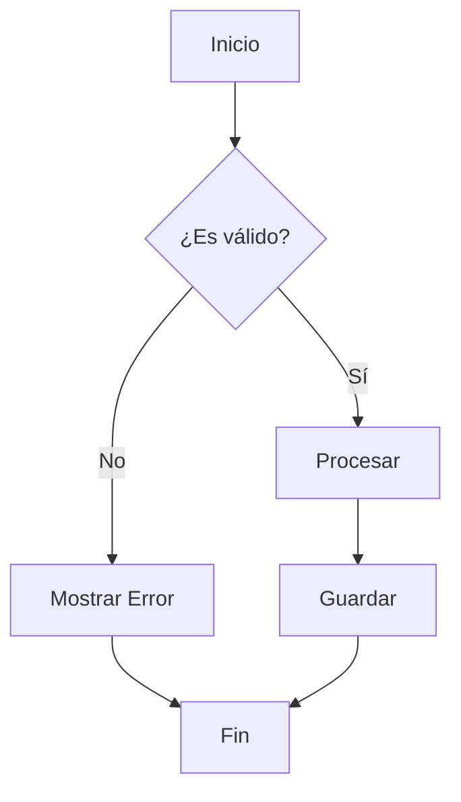
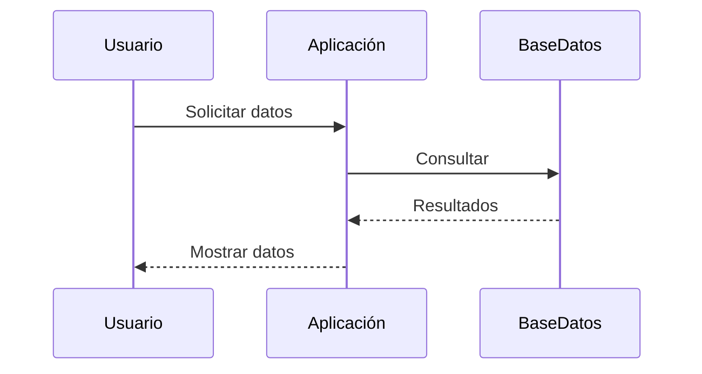
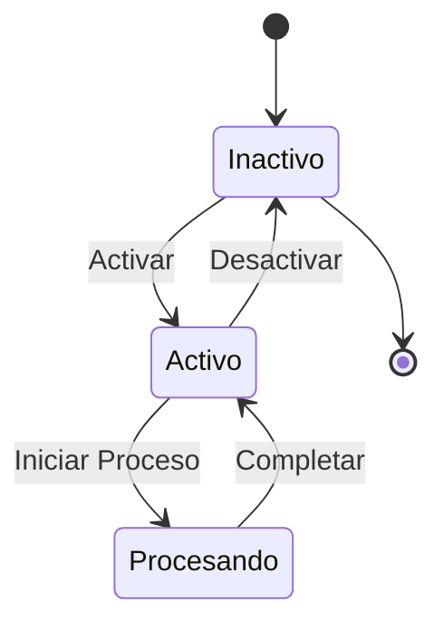
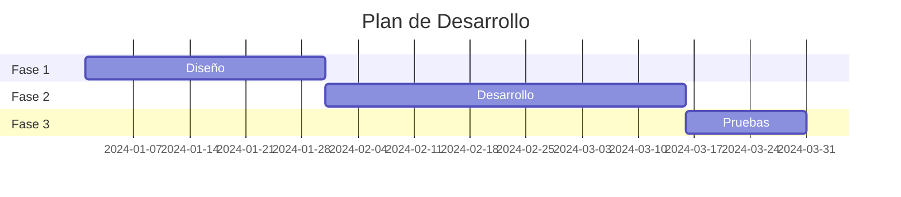
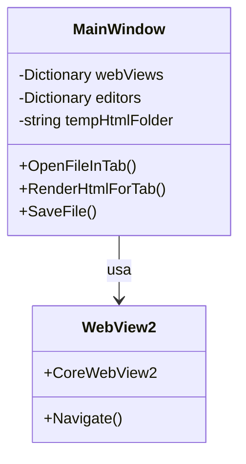
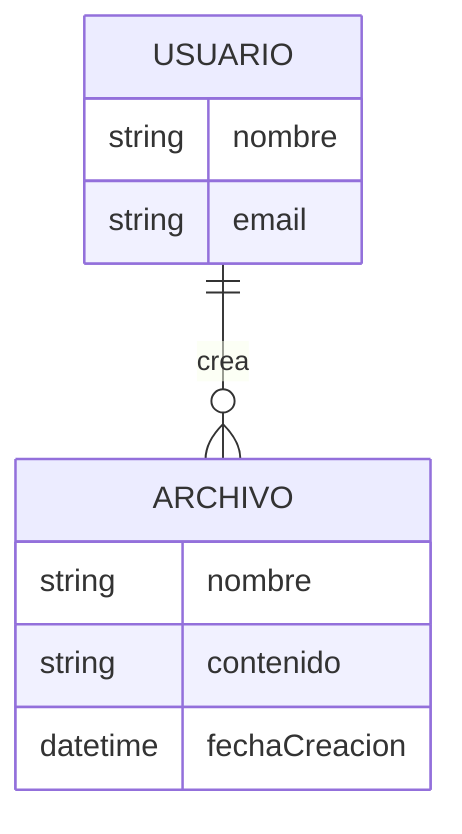
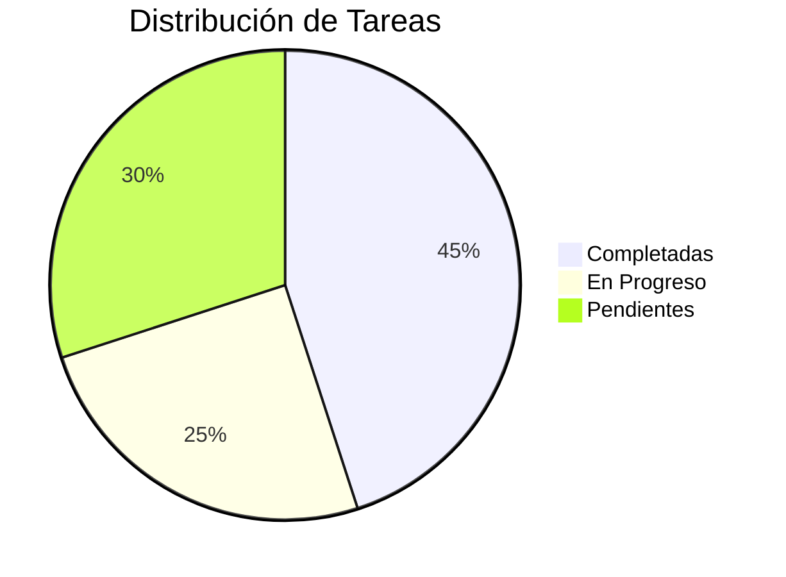
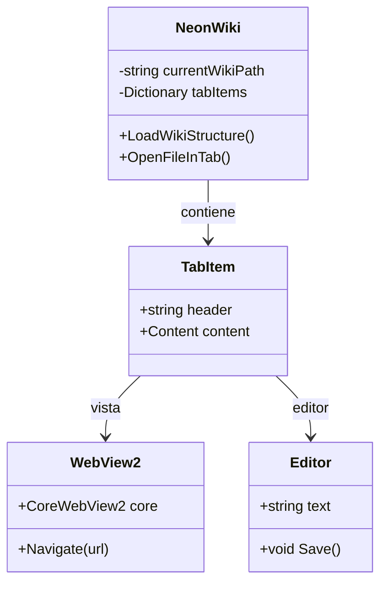

# 📊 Diagramas Mermaid

Este archivo contiene ejemplos de diagramas Mermaid que puedes usar en tu wiki.

---

## 🔄 Diagrama de Flujo Simple



---

## 🎯 Diagrama de Secuencia



---

## 🏢 Diagrama de Estado



---

## 📈 Diagrama Gantt



---

## 🎨 Diagrama de Clases



---

## 🔀 Diagrama Entidad-Relación



---

## 📋 Pie Chart



---

## 🎓 Diagrama de Clase UML Completo



---

## 💡 Tipos de Diagramas Soportados

Mermaid soporta muchos tipos de diagramas:

- **Flowchart** (graph TD, graph LR)
- **Sequence Diagram** (sequenceDiagram)
- **State Diagram** (stateDiagram)
- **Gantt Chart** (gantt)
- **Class Diagram** (classDiagram)
- **Entity Relationship** (erDiagram)
- **Pie Chart** (pie)
- **Journey Diagram** (journey)
- **Git Graph** (gitGraph)
- Y más...

---

## 📝 Cómo Usar

1. Escribe tu código Mermaid en un bloque de código markdown
2. Especifica el lenguaje como `mermaid`:
   ````markdown
   ```mermaid
   graph TD
       A --> B
   ```
   ````
3. El diagrama se renderizará automáticamente con el tema NEON 🎨

---

**¡Disfruta creando diagramas en tu wiki!** ⚡

