# Guía Completa de Diagramas Mermaid

## Índice

1. [Flowchart (Diagrama de Flujo)](#1-flowchart-diagrama-de-flujo)
2. [Sequence Diagram (Diagrama de Secuencia)](#2-sequence-diagram-diagrama-de-secuencia)
3. [Class Diagram (Diagrama de Clases)](#3-class-diagram-diagrama-de-clases)
4. [State Diagram (Diagrama de Estados)](#4-state-diagram-diagrama-de-estados)
5. [Entity Relationship Diagram (Diagrama ER)](#5-entity-relationship-diagram-diagrama-er)
6. [User Journey (Viaje del Usuario)](#6-user-journey-viaje-del-usuario)
7. [Gantt Diagram (Diagrama de Gantt)](#7-gantt-diagram-diagrama-de-gantt)
8. [Pie Chart (Gráfico Circular)](#8-pie-chart-gráfico-circular)
9. [Quadrant Chart (Gráfico de Cuadrantes)](#9-quadrant-chart-gráfico-de-cuadrantes)
10. [Requirement Diagram (Diagrama de Requisitos)](#10-requirement-diagram-diagrama-de-requisitos)
11. [Gitgraph (Gráfico Git)](#11-gitgraph-gráfico-git)
12. [C4 Diagram (Diagrama C4)](#12-c4-diagram-diagrama-c4)
13. [Mindmap (Mapa Mental)](#13-mindmap-mapa-mental)
14. [Timeline (Línea de Tiempo)](#14-timeline-línea-de-tiempo)
15. [Sankey Diagram (Diagrama Sankey)](#15-sankey-diagram-diagrama-sankey)
16. [XY Chart (Gráfico XY)](#16-xy-chart-gráfico-xy)
17. [Block Diagram (Diagrama de Bloques)](#17-block-diagram-diagrama-de-bloques)

---

## 1. Flowchart (Diagrama de Flujo)

Ideal para representar procesos, algoritmos y flujos de trabajo.

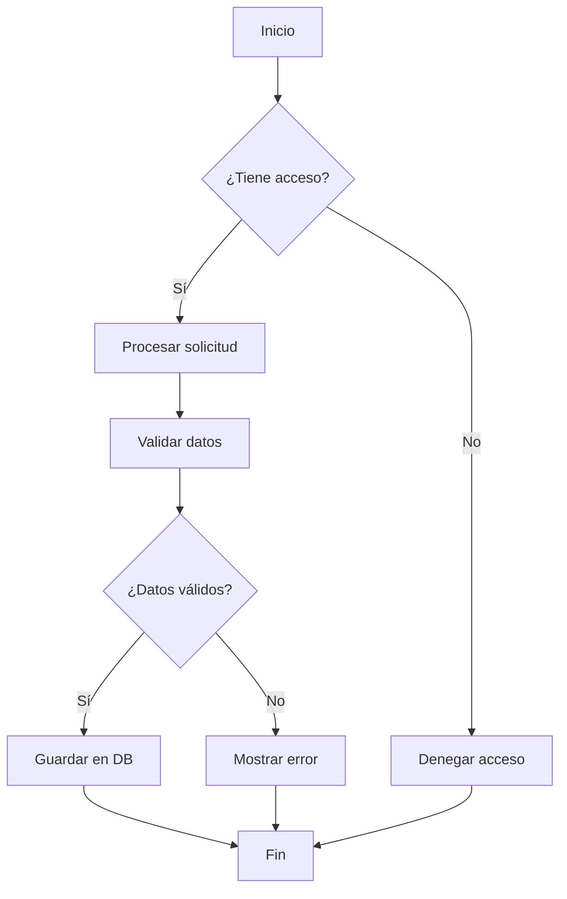

**Direcciones disponibles:**
- `TD` o `TB` (Top Down)
- `BT` (Bottom to Top)
- `LR` (Left to Right)
- `RL` (Right to Left)

---

## 2. Sequence Diagram (Diagrama de Secuencia)

Perfecto para mostrar interacciones entre objetos o componentes en el tiempo.

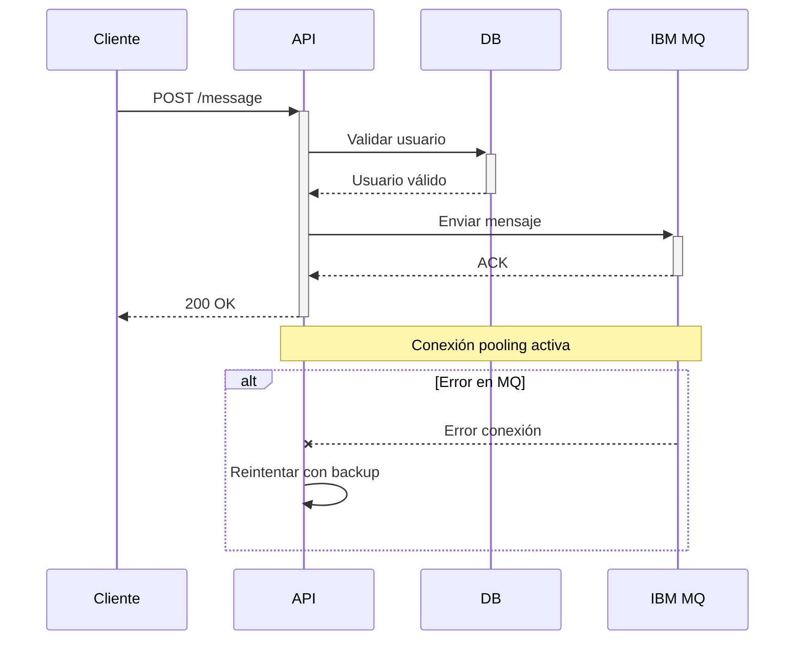

---

## 3. Class Diagram (Diagrama de Clases)

Para modelar estructuras orientadas a objetos, clases y sus relaciones.

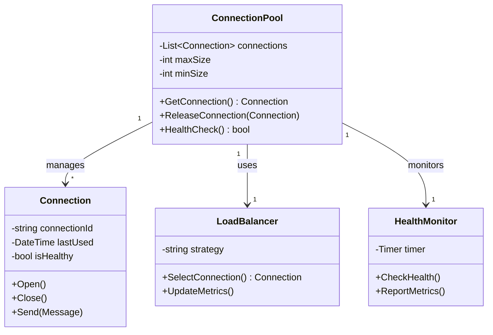

---

## 4. State Diagram (Diagrama de Estados)

Representa los estados de un sistema y las transiciones entre ellos.

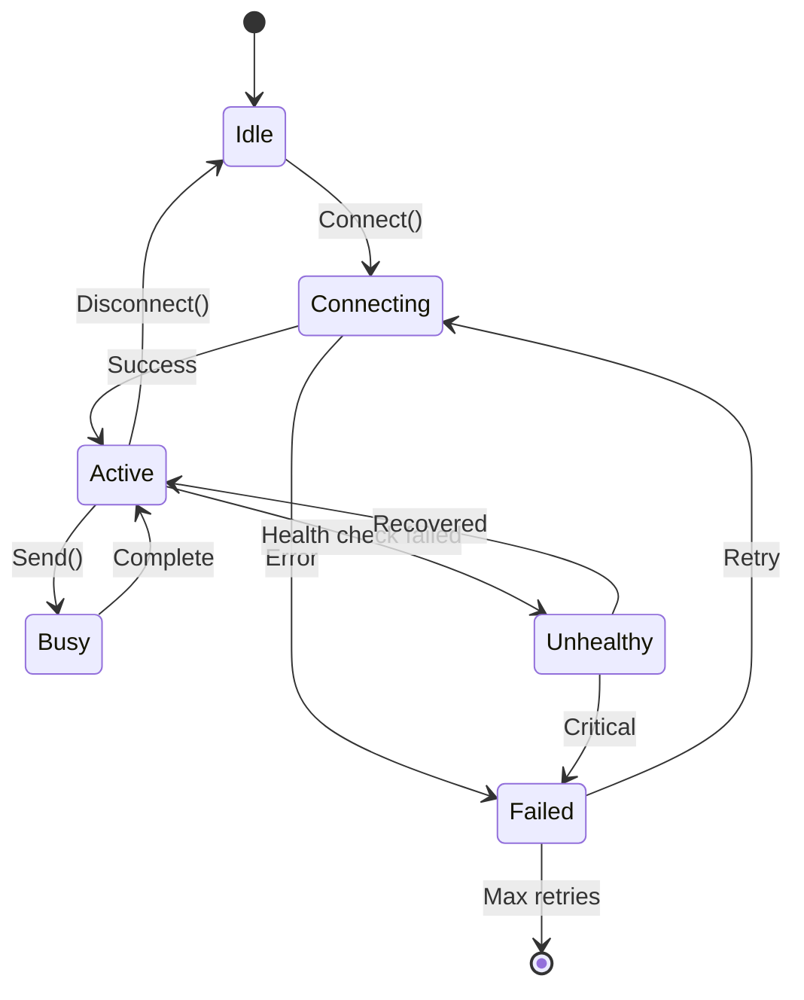

---

## 5. Entity Relationship Diagram (Diagrama ER)

Para modelar bases de datos y relaciones entre entidades.

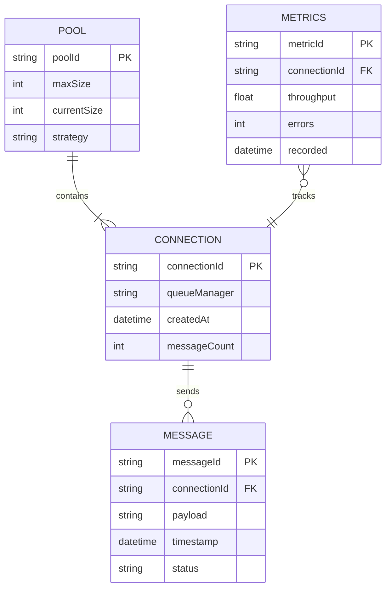

---

## 6. User Journey (Viaje del Usuario)

Documenta la experiencia del usuario a través de diferentes etapas.

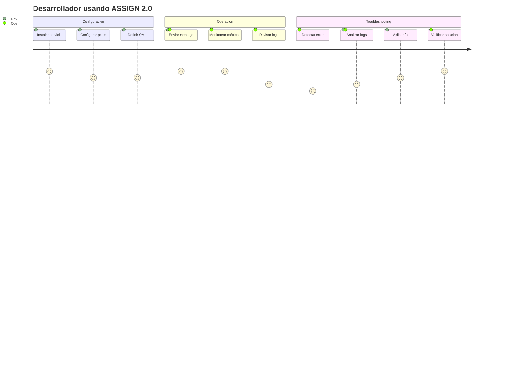

---

## 7. Gantt Diagram (Diagrama de Gantt)

Para planificación de proyectos y cronogramas.

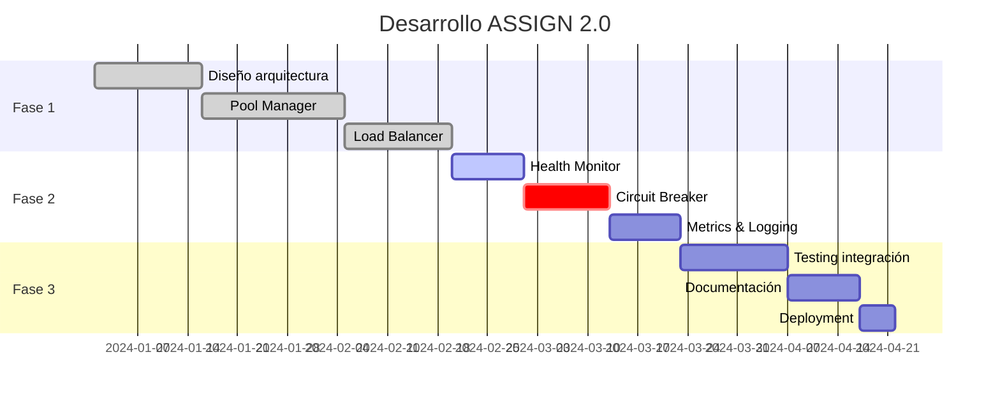

---

## 8. Pie Chart (Gráfico Circular)

Para mostrar proporciones y distribuciones.

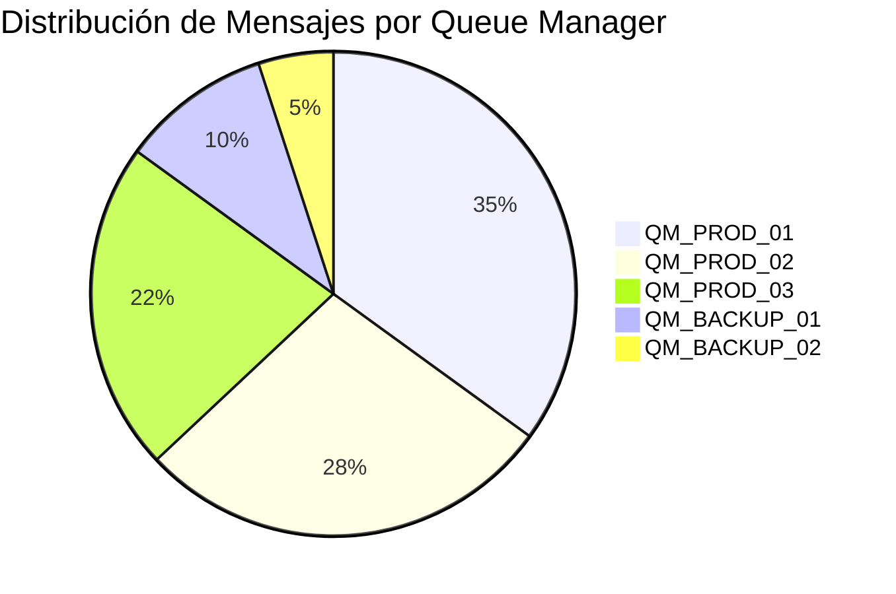

---

## 9. Quadrant Chart (Gráfico de Cuadrantes)

Para análisis de prioridades o clasificación en dos dimensiones.

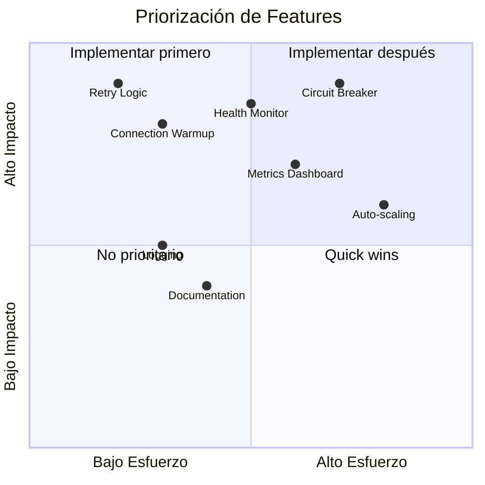

---

## 10. Requirement Diagram (Diagrama de Requisitos)

Para modelar requisitos y sus relaciones.

```mermaid
requirementDiagram
    requirement high_availability {
        id: REQ-001
        text: Sistema debe tener 99.9% uptime
        risk: high
        verifymethod: test
    }
    
    requirement performance {
        id: REQ-002
        text: Procesar 1200 msg/seg
        risk: medium
        verifymethod: test
    }
    
    requirement monitoring {
        id: REQ-003
        text: Métricas en tiempo real
        risk: low
        verifymethod: inspection
    }
    
    functionalRequirement connection_pool {
        id: FR-001
        text: Pool de conexiones configurable
        risk: medium
        verifymethod: test
    }
    
    performanceRequirement latency {
        id: PR-001
        text: Latencia < 50ms
        risk: high
        verifymethod: test
    }
    
    high_availability - satisfies -> connection_pool
    performance - satisfies -> connection_pool
    monitoring - satisfies -> connection_pool
    connection_pool - refines -> latency
```

---

## 11. Gitgraph (Gráfico Git)

Para visualizar ramas y estrategias de versionamiento.

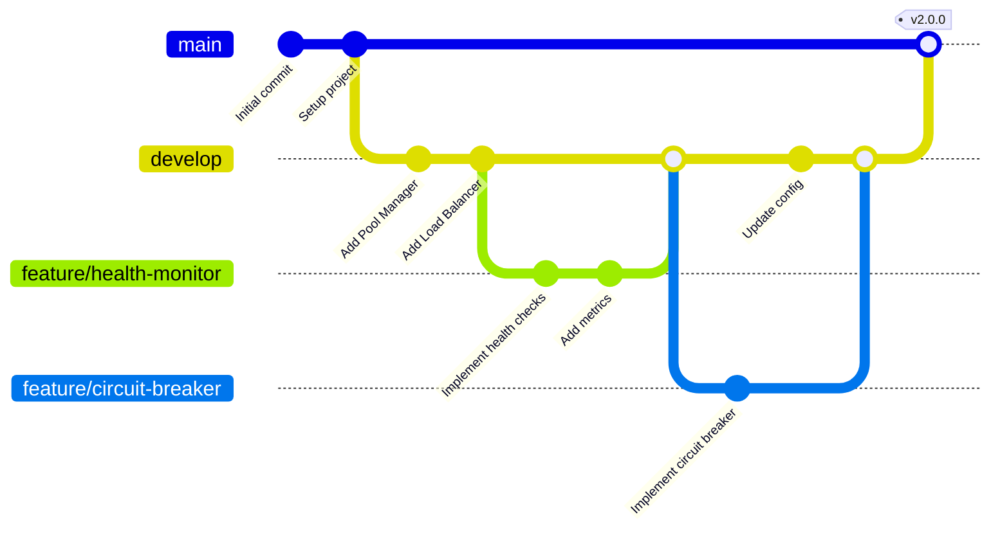

---

## 12. C4 Diagram (Diagrama C4)

Para arquitectura de software en diferentes niveles de abstracción.

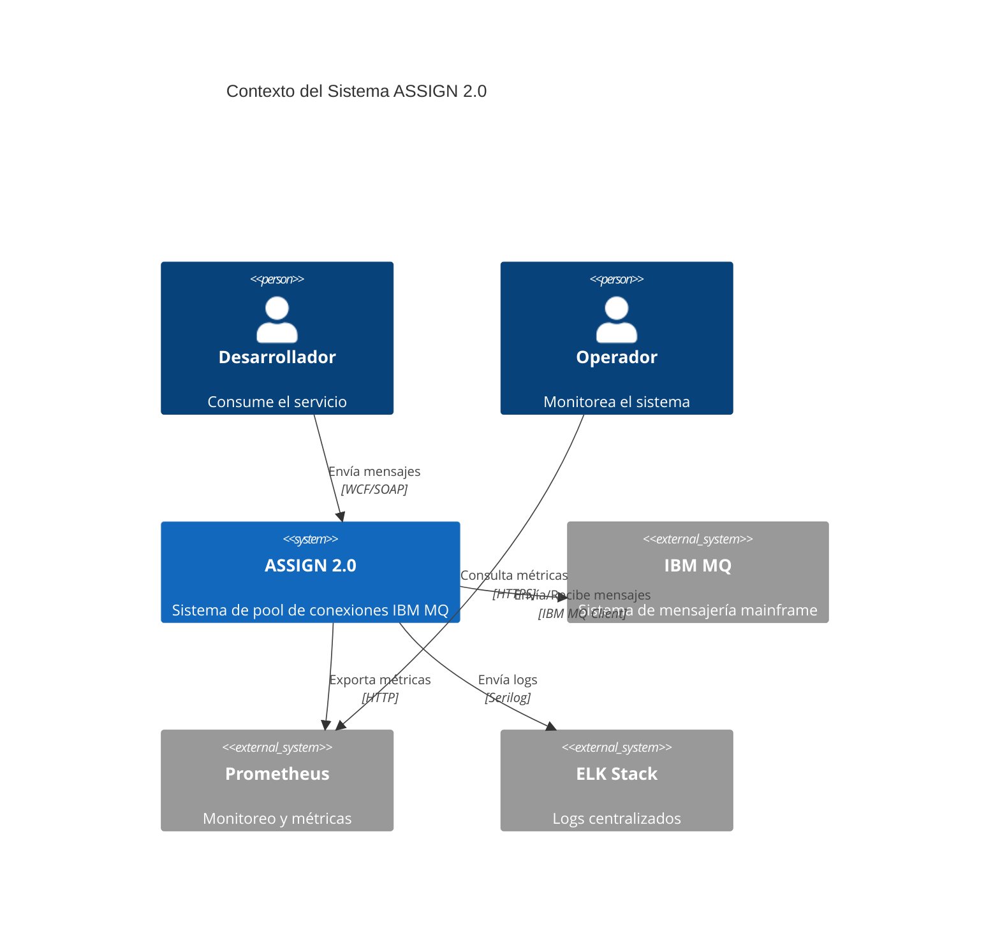

---

## 13. Mindmap (Mapa Mental)

Para brainstorming y organización de ideas.

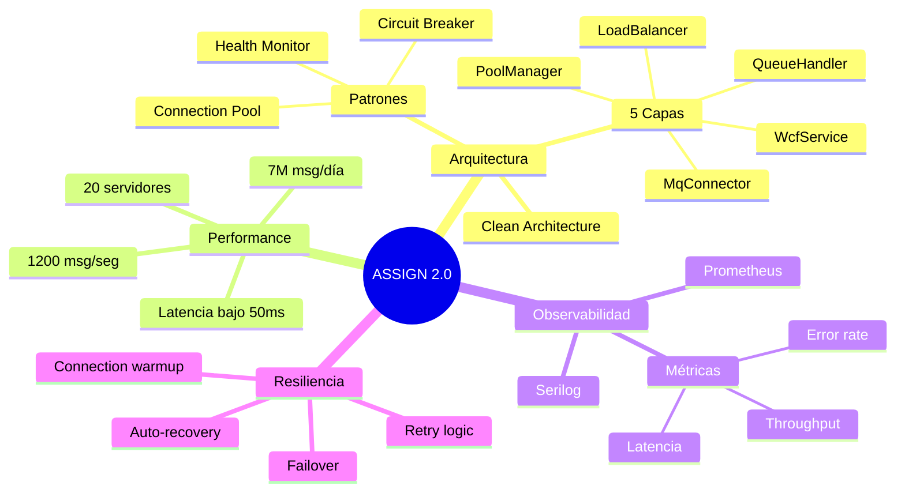

---

## 14. Timeline (Línea de Tiempo)

Para mostrar eventos cronológicos.

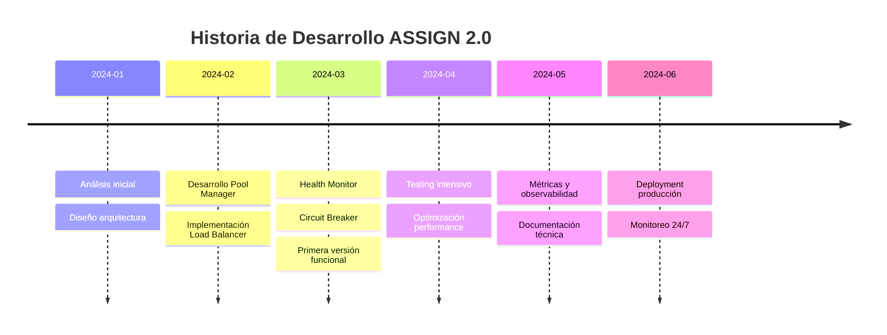

---

## 15. Sankey Diagram (Diagrama Sankey)

Para visualizar flujos y distribuciones.

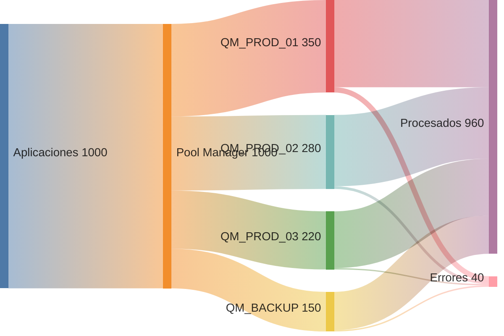

---

## 16. XY Chart (Gráfico XY)

Para visualizar datos en ejes cartesianos.

```mermaid
xychart-beta
    title "Throughput por Hora - ASSIGN 2.0"
    x-axis [00:00, 04:00, 08:00, 12:00, 16:00, 20:00, 23:59]
    y-axis "Mensajes/segundo" 0 --> 1400
    line [200, 150, 800, 1200, 1100, 900, 400]
    bar [180, 140, 750, 1150, 1050, 850, 380]
```

---

## 17. Block Diagram (Diagrama de Bloques)

Para representar componentes y sus conexiones (experimental).

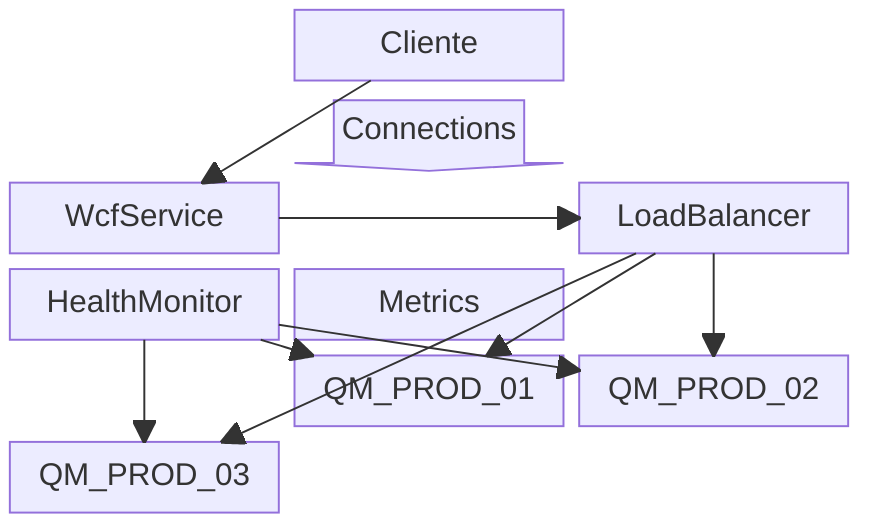

---

## Notas Adicionales

### Sintaxis Básica

- Los diagramas siempre inician con el tipo: `flowchart`, `sequenceDiagram`, `classDiagram`, etc.
- Los comentarios se hacen con `%%`
- Los estilos se pueden aplicar con `style` o `classDef`

### Compatibilidad

Estos diagramas funcionan en:
- GitHub/GitLab markdown
- Documentación técnica
- Notion, Obsidian
- VS Code con extensiones
- Tu aplicación Mini-Wiki Markdown 😉

### Recursos

- [Documentación oficial Mermaid](https://mermaid.js.org/)
- [Live Editor](https://mermaid.live/)
- [Mermaid Chart](https://www.mermaidchart.com/)

---

**Creado para navegación rápida y referencia técnica** 🚀
